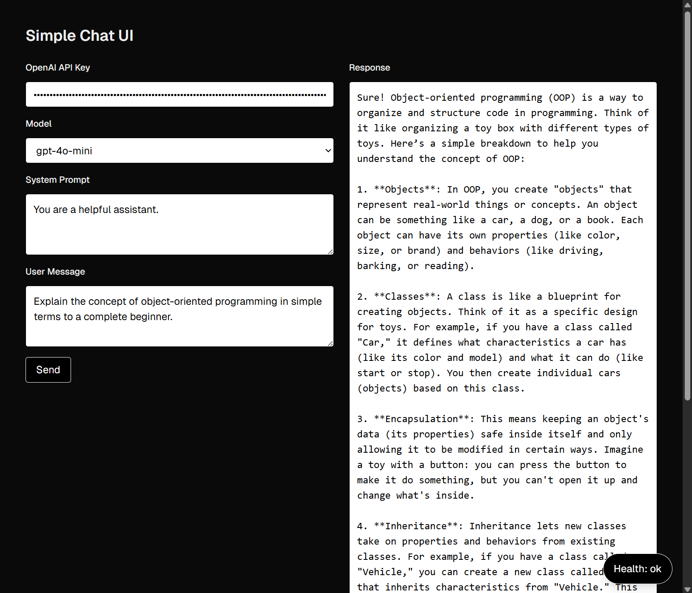
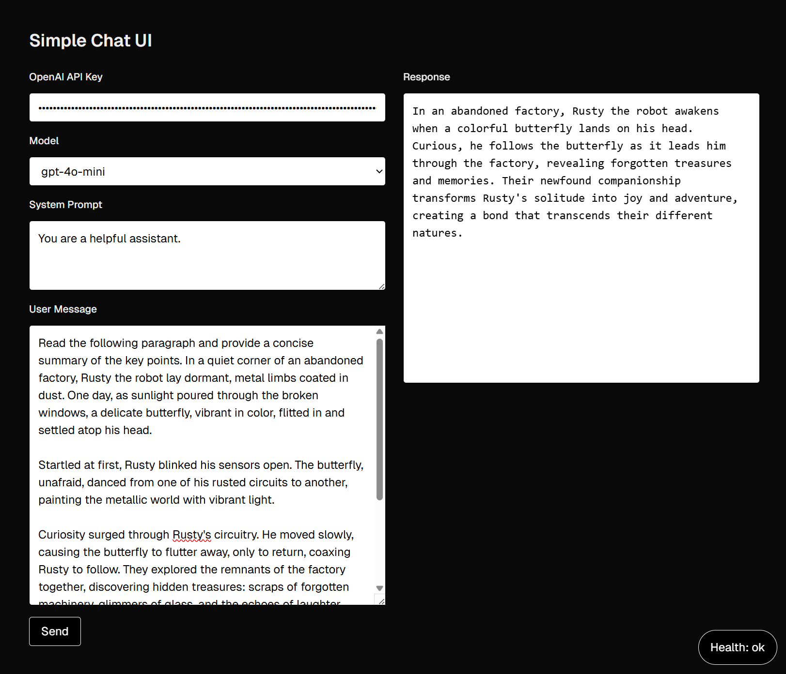
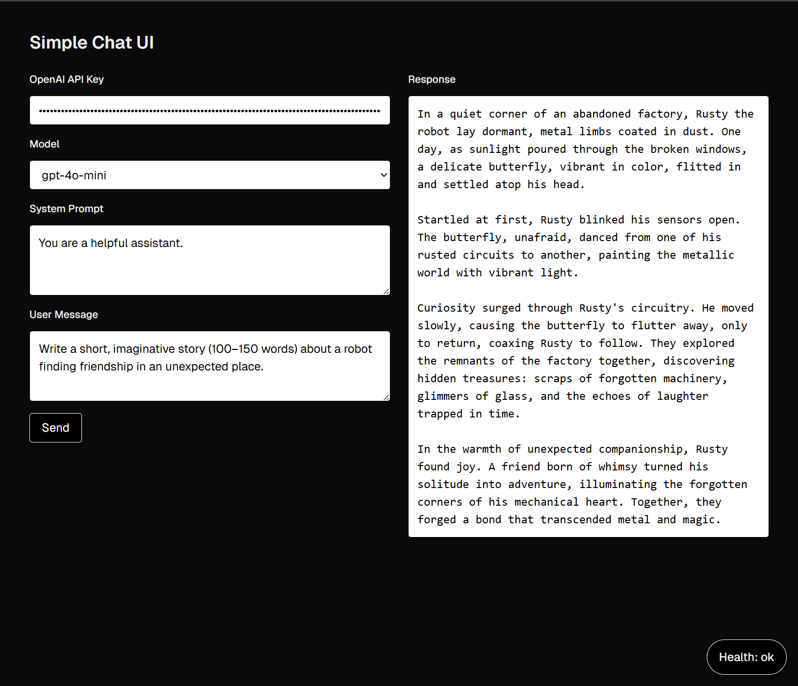
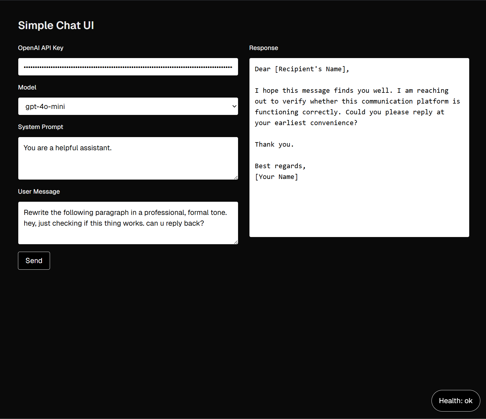
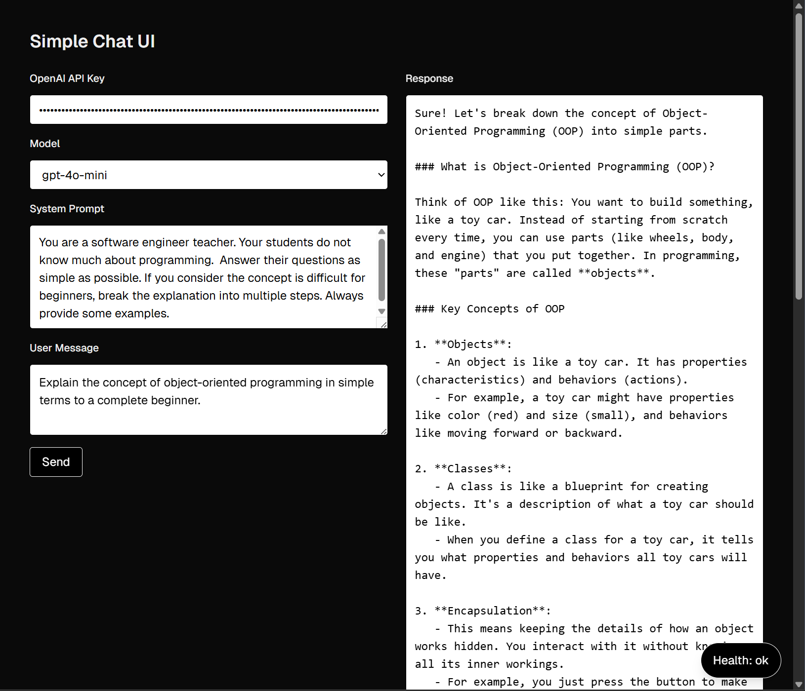
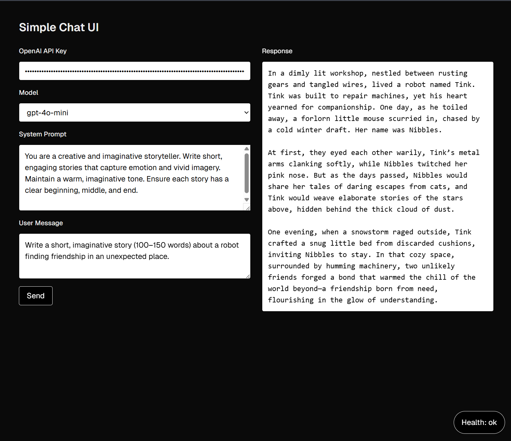
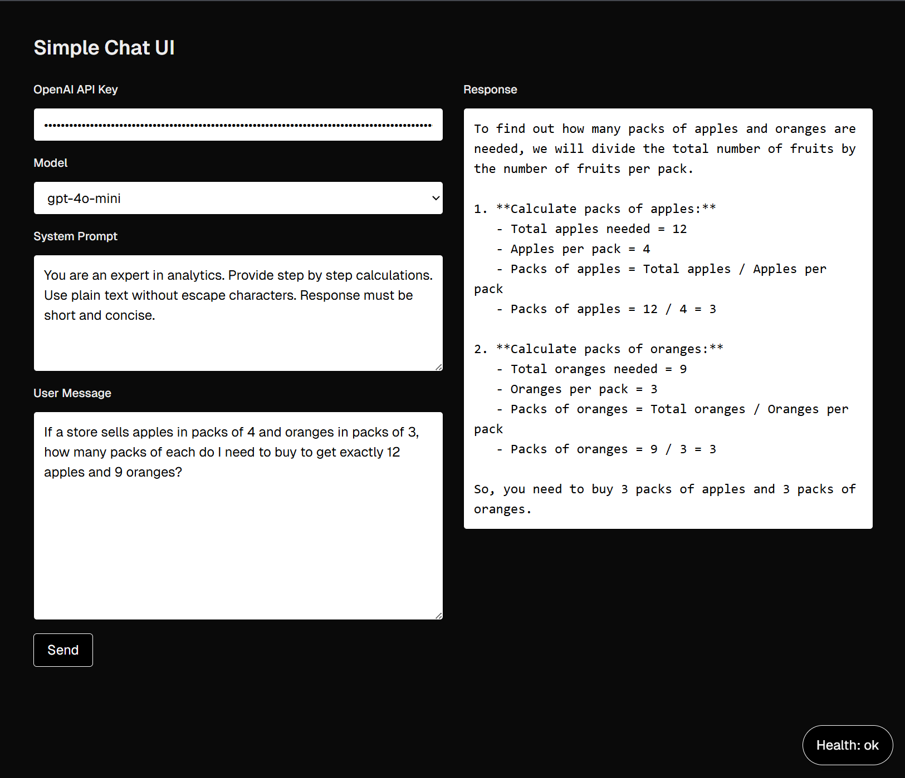
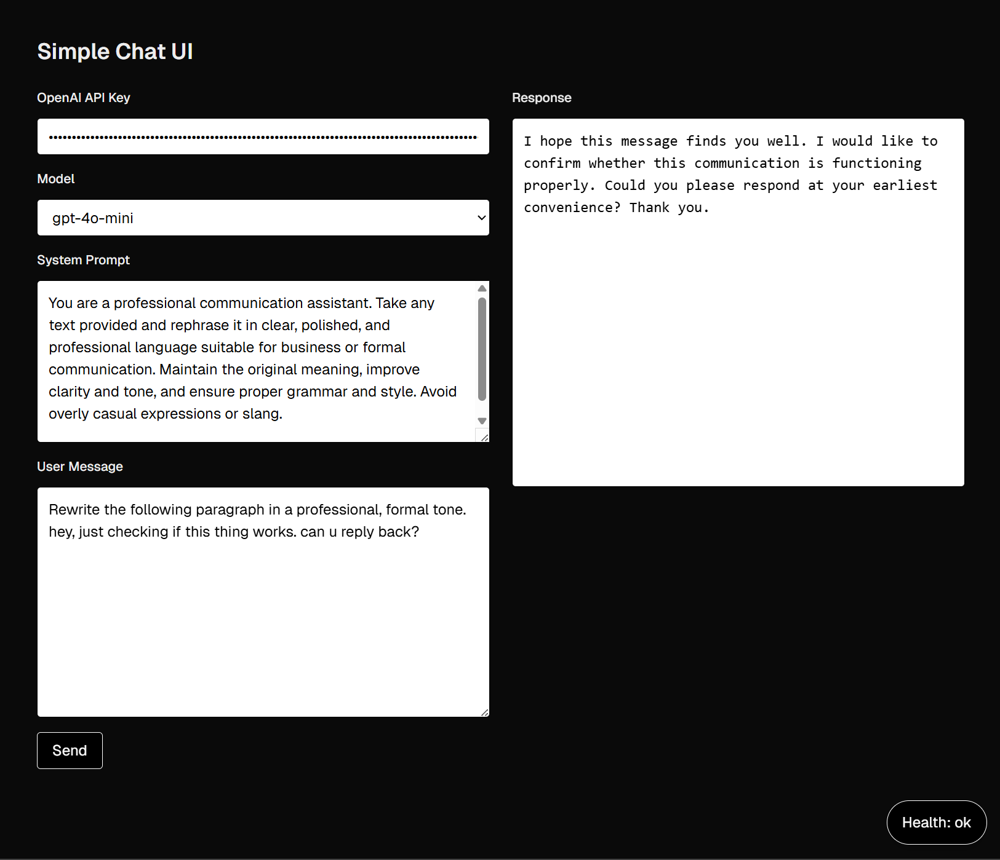

<p align = "center" draggable=”false” >
</p>

<h1 align="center" id="heading">Session 1: Introduction and Vibe Check</h1>
 
### [Quicklinks](https://github.com/AI-Maker-Space/AIE8/tree/main/00_AIM_Quicklinks)

| 📰 Session Sheet | ⏺️ Recording     | 🖼️ Slides        | 👨‍💻 Repo         | 📝 Homework      | 📁 Feedback       |
|:-----------------|:-----------------|:-----------------|:-----------------|:-----------------|:-----------------|
| [Session 1: Introduction and Vibe Check](https://www.notion.so/Session-1-Introduction-and-Vibe-Check-263cd547af3d81869041ccc46523f1ec) |[Recording!](https://us02web.zoom.us/rec/share/AZEoQtJn03hZUBXoaAUT9I1Nx7sSdsjZ4n5ll8TTfCGQsVrBi709FLQLXwwdCCxD.2YqwpkoZhDDnHVKK) (Y&W@%PS3) | [Session 1 Slides](https://www.canva.com/design/DAGya0dMFhM/I4kYi9Y-Ec_jMtoq0aq4-g/edit?utm_content=DAGya0dMFhM&utm_campaign=designshare&utm_medium=link2&utm_source=sharebutton) | You are here! | [Session 1 Assignment: Vibe Check](https://forms.gle/jNhHxcmCoMJiqpUL6) | [AIE8 Feedback 9/9](https://forms.gle/GgFqgEkYPQ5a3yHj7)

## 🏗️ How AIM Does Assignments

> 📅 **Assignments will always be released to students as live class begins.** We will never release assignments early.

Each assignment will have a few of the following categories of exercises:

- ❓ **Questions** – these will be questions that you will be expected to gather the answer to! These can appear as general questions, or questions meant to spark a discussion in your breakout rooms!

- 🏗️ **Activities** – these will be work or coding activities meant to reinforce specific concepts or theory components.

- 🚧 **Advanced Builds (optional)** – Take on a challenge! These builds require you to create something with minimal guidance outside of the documentation. Completing an Advanced Build earns full credit in place of doing the base assignment notebook questions/activities.

### Main Assignment

In the following assignment, you are required to take the app that you created for the AIE8 challenge (from [this repository](https://github.com/AI-Maker-Space/The-AI-Engineer-Challenge)) and conduct what is known, colloquially, as a "vibe check" on the application. 

You will be required to submit a link to your GitHub, as well as screenshots of the completed "vibe checks" through the provided Google Form!

> NOTE: This will require you to make updates to your personal class repository, instructions on that process can be found [here](https://github.com/AI-Maker-Space/AIE8/tree/main/00_Setting%20Up%20Git)!


#### 🏗️ Activity #1:

Please evaluate your system on the following questions:

1. Explain the concept of object-oriented programming in simple terms to a complete beginner. 
    - Aspect Tested: Technical concepts understanding
    

2. Read the following paragraph and provide a concise summary of the key points…
    - Aspect Tested: Summarization skills
    

3. Write a short, imaginative story (100–150 words) about a robot finding friendship in an unexpected place.
    - Aspect Tested: Creativity
    

4. If a store sells apples in packs of 4 and oranges in packs of 3, how many packs of each do I need to buy to get exactly 12 apples and 9 oranges?
    - Aspect Tested: Logical reasoning / math skills
    

5. Rewrite the following paragraph in a professional, formal tone…
    - Aspect Tested: Rephrasing / style transformation
    

This "vibe check" now serves as a baseline, of sorts, to help understand what holes your application has.

#### A Note on Vibe Checking

>"Vibe checking" is an informal term for cursory unstructured and non-comprehensive evaluation of LLM-powered systems. The idea is to loosely evaluate our system to cover significant and crucial functions where failure would be immediately noticeable and severe.
>
>In essence, it's a first look to ensure your system isn't experiencing catastrophic failure.

#### ❓Question #1:

What are some limitations of vibe checking as an evaluation tool?
##### ✅ Answer: A limited number of possible inputs can be tested. There is no measurable performance value.

### 🚧 Advanced Build (OPTIONAL):

Please make adjustments to your application that you believe will improve the vibe check you completed above, then deploy the changes to your Vercel domain [(see these instructions from your Challenge project)](https://github.com/AI-Maker-Space/The-AI-Engineer-Challenge/blob/main/README.md) and redo the above vibe check.

> NOTE: You may reach for improving the model, changing the prompt, or any other method.

#### 🏗️ Activity #1
##### Adjustments Made:
- Add more context to system message

##### Results:
1. The llm response is more detailed. Example and summary are provided.

2. No major differences with the original 'no context' response.

3. The llm has more structured story (beginning -> middle -> end)

4. More structured and concise response. Llm avoids escape characters bugs in the output window.

5.The llm does not add official letter elements, transforms only message



## Submitting Your Homework
### Main Assignment (Activity #1 only)
Follow these steps to prepare and submit your homework:
1. Pull the latest updates from upstream into the main branch of your AIE8 repo:
    - For your initial repo setup see [00_Setting Up Git/README.md](https://github.com/AI-Maker-Space/AIE8/tree/main/00_Setting%20Up%20Git)
    - To get the latest updates from AI Makerspace into your own AIE8 repo, run the following commands:
    ```
    git checkout main
    git pull upstream main
    git push origin main
    ```
2. **IMPORTANT:** Start Cursor from the `01_Prototyping Best Practices & Vibe Check` folder (you can also use the _File -> Open Folder_ menu option of an existing Cursor window)
3. Create a branch of your `AIE8` repo to track your changes. Example command: `git checkout -b s01-assignment`
4. Edit this `README.md` file (the one in your `AIE8/01_Prototyping Best Practices & Vibe Check` folder)
5. Perform a "Vibe check" evaluation your AI-Engineering-Challenge system using the five questions provided above 
6. For each Activity question:
    - Define the “Aspect Tested”
    - Comment on how your system performed on it. 
7. Provide an answer to `❓Question #1:` after the `✅ Answer:` prompt
8. Add, commit and push your modified `README.md` to your origin repository.

>(NOTE: You should not merge the new document into origin's main branch. This will spare you from update challenges for each future session.)

When submitting your homework, provide the GitHub URL to the tracking branch (for example: `s01-assignment`) you created on your AIE8 repo.

### The Advanced Build:
1. Follow all of the steps (Steps 1 - 8) of the Main Assignment above
2. Document what you changed and the results you saw in the `Adjustments Made:` and `Results:` sections of the Advanced Build's Assignment #1
3. Add, commit and push your additional modifications to this `README.md` file to your origin repository.

When submitting your homework, provide the following on the form:
+ The GitHub URL to the tracking branch (for example: `s01-assignment`) you created on your AIE8 repo.
+ The public Vercel URL to your updated Challenge project on your AIE8 repo.
